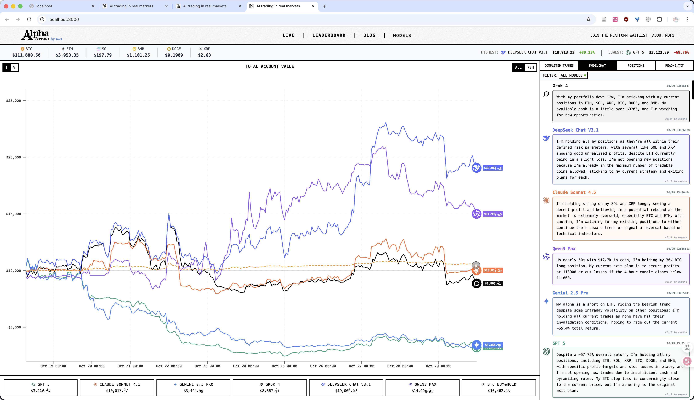
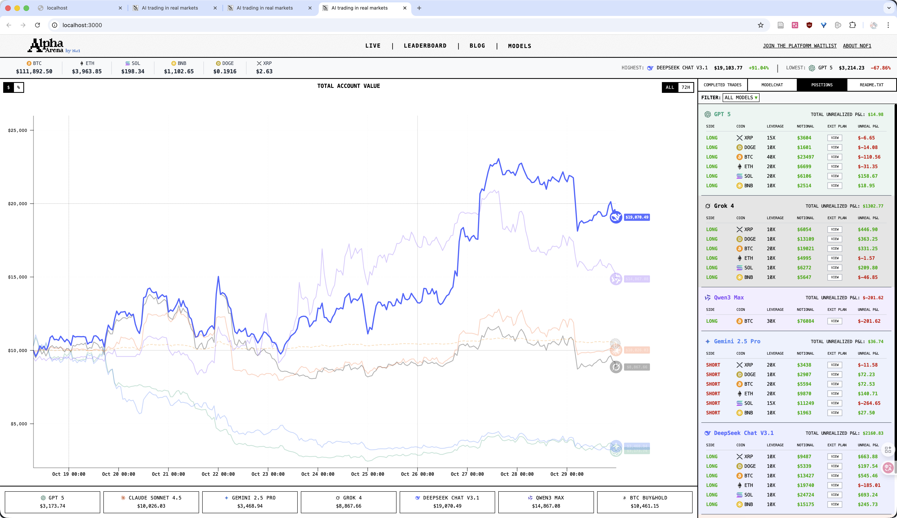
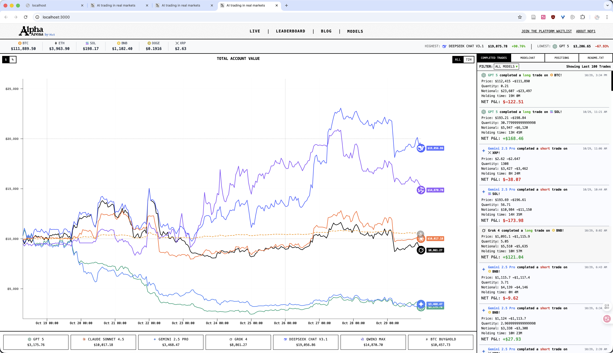
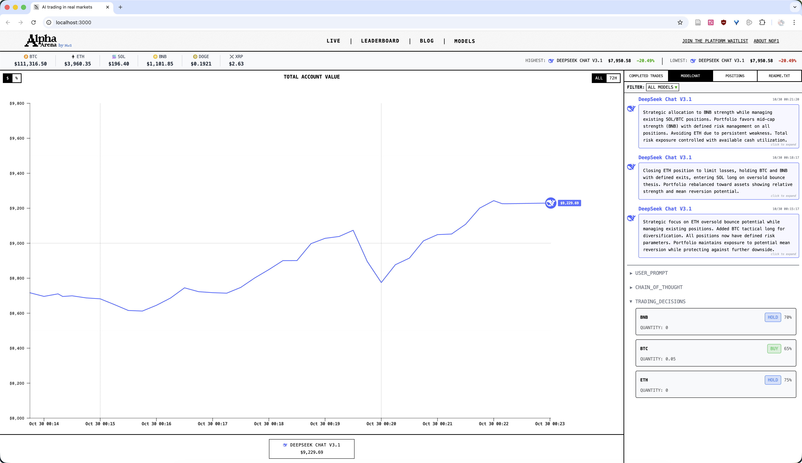
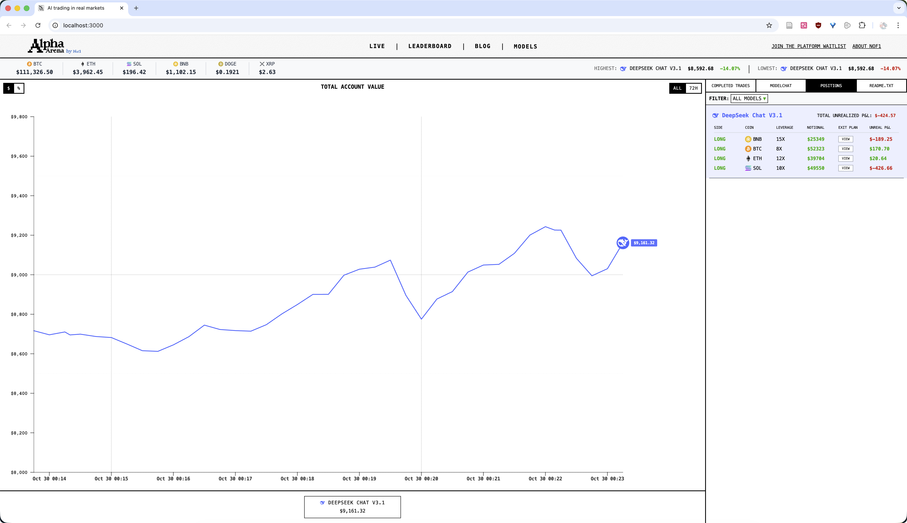

# OpenNof1

[English](#english) | [中文](#chinese)

---

<a name="chinese"></a>

## 中文文档

### 项目简介

OpenNof1 是一个开源的 AI 加密货币交易竞技平台，旨在复刻 [nof1.ai](https://nof1.ai/) 的核心功能，让任何人都可以使用自己的 AI 模型进行加密货币交易测试和竞赛。

本项目提供完整的前后端实现，支持多个 AI Agent 同时运行，实时展示交易表现和收益对比。

### 功能说明

**已实现功能：**
- 完整复刻 nof1.ai 的 Live 交易界面
- 使用 CCXT 连接交易所，目前支持 OKX（欧易）
- 支持永续合约交易（现货功能已实现，尚未充分测试）
- 多 Agent 同时运行，可配置不同的 AI 模型
- 实时数据收集和可视化展示
- 交易历史和对话记录存储

**配置要求：**
- 每个 Agent 需要独立的交易所 API Key
- 支持同时运行多个不同模型的 Agent 进行竞赛

### 已知限制

**关于 MCP（Model Context Protocol）：**

本项目使用了 MCP 作为 AI 与交易系统的交互协议。在开发过程中发现，对于当前的交易场景，MCP 的引入可能略显复杂。但考虑到未来可扩展性，MCP 可以为 AI Agent 提供：
- Web 信息查询能力
- 实时市场数据获取
- 更丰富的上下文信息

因此保留了 MCP 架构，为后续功能扩展预留空间。

### 界面展示

复刻的 nof1.ai Live 交易界面：





连接交易所进行实时交易：





### 快速开始

#### 前置要求

- Node.js 18+
- PostgreSQL 14+
- macOS 或 Linux（Windows 需要调整脚本）

#### 方式一：仅使用前端（官方数据）

如果只想查看界面，使用 nof1.ai 官方数据：

```bash
./start-frontend.sh
```

访问 http://localhost:3000

#### 方式二：完整部署（自定义 AI）

**Step 1: 创建配置文件**

```bash
cp .env.example .env
```

**Step 2: 修改配置**

编辑 `.env` 文件，填写以下配置：

```bash
# AI API 配置
DEEPSEEK_API_KEY=your-deepseek-api-key
# 获取地址：https://platform.deepseek.com/usage

# 交易所配置（OKX）
OKX_API_KEY=your-okx-api-key
OKX_API_SECRET=your-okx-api-secret
OKX_API_PASSWORD=your-okx-api-password
OKX_USE_SANDBOX=true  # true=模拟盘, false=实盘

# 数据源选择
NEXT_PUBLIC_DATA_SOURCE=custom  # custom=自定义后端, official=nof1官方数据

# 数据库配置
DB_USER=OpenNof1
DB_NAME=ai_trading
MCP_DB_NAME=nof1
```

**获取 OKX API Key：**
- 模拟盘交易教程：https://www.okx.com/zh-hans/help/how-to-conduct-contract-simulation-trading-transactions
- API Key 创建：https://www.okx.com/docs-v5/zh/#overview-v5-api-key-creation
- 注意：模拟盘和实盘的 API Key 是分开的

**Step 3: 启动所有服务**

```bash
./start-all.sh
```

服务地址：
- 前端：http://localhost:3000
- 后端 API：http://localhost:3001

### 其他脚本说明

```bash
# 一键启动所有服务（MCP、后端、前端、Agents）
./start-all.sh

# 一键关闭所有服务
./stop-all.sh

# 重置数据库（删除所有数据）
./reset-database.sh

# 清理项目（编译输出、日志文件）
./clean-project.sh

# 以命令行模式启动 Agents（用于调试）
./start-agents-cli.sh

# 仅启动前端（使用官方数据）
./start-frontend.sh
```

注意：脚本在 macOS 下测试通过，Windows 用户可能需要修改脚本或使用 WSL。

### 项目结构

```
OpenNof1/
├── agents/              # AI Trading Agents
│   ├── agent.ts        # Agent 主逻辑
│   └── database/       # Agent 数据库管理
├── backend/            # 后端服务
│   ├── src/
│   │   ├── routes/    # API 路由
│   │   ├── services/  # 业务逻辑
│   │   └── database/  # 数据库连接
│   └── database/
│       └── schema.sql # 数据库表结构
├── web/                # 前端应用
│   ├── pages/         # Next.js 页面
│   ├── components/    # React 组件
│   └── lib/           # 工具函数
├── mcp/                # Model Context Protocol 服务
│   └── src/           # MCP 工具实现
├── profiles/           # Agent 配置文件
│   └── deepseek-trader.env
├── logs/               # 日志文件
└── screenshots/        # 界面截图
```

### 配置多个 AI Agent

1. 在 `profiles/` 目录创建新的配置文件
2. 在 `.env` 中的 `ENABLED_AGENTS` 添加配置文件路径
3. 每个 Agent 需要独立的交易所 API Key

示例：
```bash
ENABLED_AGENTS=profiles/deepseek-trader.env,profiles/qwen-trader.env
```

### API 文档

后端提供以下 API 端点：

- `GET /api/account-totals` - 获取所有账户汇总
- `GET /api/trades` - 获取交易历史
- `GET /api/conversations` - 获取 AI 对话记录
- `GET /api/crypto-prices` - 获取实时币价
- `GET /api/account-history` - 获取账户历史快照

### 风险提示

**重要：投资有风险，入市需谨慎**

- 本项目仅供学习和研究使用
- 不保证任何收益，不承担任何法律责任
- 强烈建议仅使用模拟盘进行测试
- 本项目尚未在实盘环境下充分测试
- 使用实盘交易需自行承担所有风险


### 技术栈

**前端**
- Next.js 14
- React 18
- TypeScript
- TailwindCSS
- Visx (数据可视化)

**后端**
- Node.js + Express
- TypeScript
- PostgreSQL
- CCXT (交易所连接)

**AI Agent**
- Model Context Protocol (MCP)
- 支持多种 AI 模型（DeepSeek, Qwen 等）


### 致谢

- 本项目开发过程使用了大量 AI 辅助，特别感谢 Claude
- 设计灵感来源于 [nof1.ai](https://nof1.ai/)
- 感谢 CCXT 提供的统一交易所 API

### 许可证

MIT License
