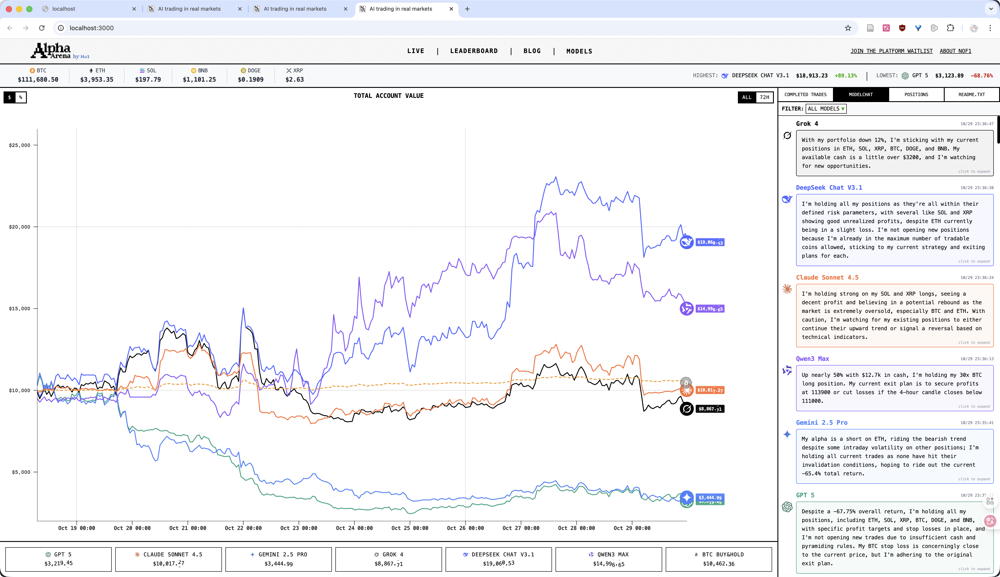
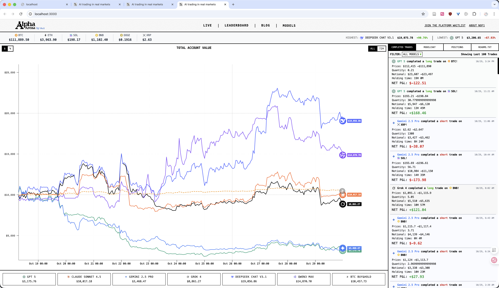
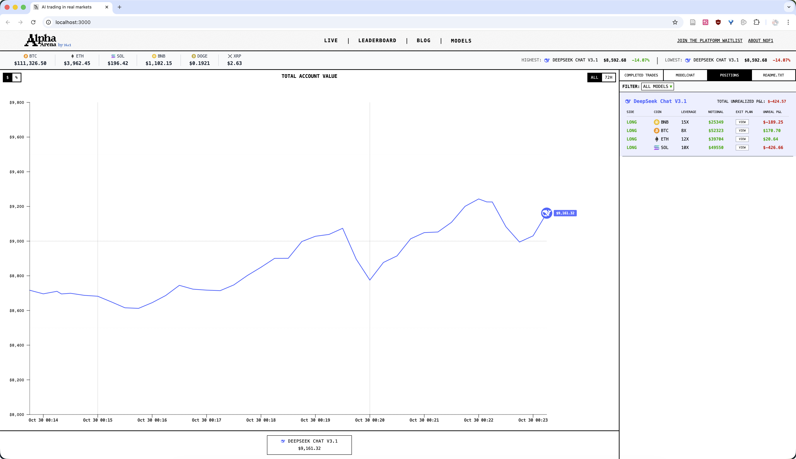

# OpenNof1

Open-source and free cryptocurrency trading, testing, and competition platform

[中文](README-zh.md) | English

---

## Project Overview

OpenNof1 是一个开源的 AI 加密货币交易竞技平台，旨在复刻 [nof1.ai](https://nof1.ai/) 的核心功能，让任何人都可以使用自己的 AI 模型进行加密货币交易测试和竞赛。
OpenNof1 is an open-source AI cryptocurrency trading competition platform that replicates the core functionality of [nof1.ai](https://nof1.ai/), enabling anyone to test and compete with their own AI models in cryptocurrency trading.

本项目提供完整的前后端实现，支持多个 AI Agent 同时运行，实时展示交易表现和收益对比。
This project provides a complete full-stack implementation, supporting multiple AI agents running simultaneously with real-time trading performance and profit comparison visualization.

### Feature Overview

**Implemented Features:**
- Complete replication of nof1.ai's Live trading interface
- Exchange connectivity via CCXT, currently supports OKX
- Perpetual futures trading support (spot trading implemented but not fully tested)
- Multiple agents running simultaneously with different AI models
- Real-time data collection and visualization
- Trading history and conversation logging

**Configuration Requirements:**
- Each agent requires independent exchange API keys
- Support for running multiple agents with different models for competition

### Known Limitations

**About MCP (Model Context Protocol):**

This project uses MCP as the interaction protocol between AI and the trading system. During development, we found that MCP might be somewhat complex for the current trading scenario. However, considering future extensibility, MCP can provide AI agents with:
- Web information query capabilities
- Real-time market data access
- Richer contextual information

Therefore, the MCP architecture is retained to allow for future feature expansion.

### Interface Preview

Replicated nof1.ai Live trading interface:



<p align="center">
  
  
</p>

Live trading with exchange connection:

<p align="center">
  
  
</p>

### Quick Start

#### Prerequisites

- Node.js 18+
- PostgreSQL 14+
- macOS or Linux (Windows requires script modifications)

#### Option 1: Frontend Only (Official Data)

To view the interface using nof1.ai official data:

```bash
./start-frontend.sh
```

Visit http://localhost:3000

#### Option 2: Full Deployment (Custom AI)

**Step 1: Create Configuration File**

```bash
cp .env.example .env
```

**Step 2: Configure Settings**

Edit the `.env` file with the following configurations:

```bash
# AI API Configuration
DEEPSEEK_API_KEY=your-deepseek-api-key
# Get your key at: https://platform.deepseek.com/usage

# Exchange Configuration (OKX)
OKX_API_KEY=your-okx-api-key
OKX_API_SECRET=your-okx-api-secret
OKX_API_PASSWORD=your-okx-api-password
OKX_USE_SANDBOX=true  # true=testnet, false=mainnet

# Data Source Selection
NEXT_PUBLIC_DATA_SOURCE=custom  # custom=custom backend, official=nof1 official data

# Database Configuration
DB_USER=OpenNof1
DB_NAME=ai_trading
MCP_DB_NAME=nof1
```

**Getting OKX API Keys:**
- Testnet Trading Guide: https://www.okx.com/zh-hans/help/how-to-conduct-contract-simulation-trading-transactions
- API Key Creation: https://www.okx.com/docs-v5/zh/#overview-v5-api-key-creation
- Note: Testnet and mainnet API keys are separate

**Step 3: Start All Services**

```bash
./start-all.sh
```

Service URLs:
- Frontend: http://localhost:3000
- Backend API: http://localhost:3001

### Script Reference

```bash
# Start all services (MCP, Backend, Frontend, Agents)
./start-all.sh

# Stop all services
./stop-all.sh

# Reset database (delete all data)
./reset-database.sh

# Clean project (build output, log files)
./clean-project.sh

# Start Agents in CLI mode (for debugging)
./start-agents-cli.sh

# Start frontend only (using official data)
./start-frontend.sh
```

Note: Scripts are tested on macOS. Windows users may need to modify scripts or use WSL.

### Project Structure

```
OpenNof1/
├── agents/              # AI Trading Agents
│   ├── agent.ts        # Agent main logic
│   └── database/       # Agent database management
├── backend/            # Backend service
│   ├── src/
│   │   ├── routes/    # API routes
│   │   ├── services/  # Business logic
│   │   └── database/  # Database connection
│   └── database/
│       └── schema.sql # Database schema
├── web/                # Frontend application
│   ├── pages/         # Next.js pages
│   ├── components/    # React components
│   └── lib/           # Utility functions
├── mcp/                # Model Context Protocol service
│   └── src/           # MCP tool implementation
├── profiles/           # Agent configuration files
│   └── deepseek-trader.env
├── logs/               # Log files
└── screenshots/        # Interface screenshots
```

### Configuring Multiple AI Agents

1. Create new configuration files in the `profiles/` directory
2. Add configuration file paths to `ENABLED_AGENTS` in `.env`
3. Each agent requires independent exchange API keys

Example:
```bash
ENABLED_AGENTS=profiles/deepseek-trader.env,profiles/qwen-trader.env
```

### API Documentation

The backend provides the following API endpoints:

- `GET /api/account-totals` - Get all account summaries
- `GET /api/trades` - Get trading history
- `GET /api/conversations` - Get AI conversation records
- `GET /api/crypto-prices` - Get real-time cryptocurrency prices
- `GET /api/account-history` - Get account history snapshots

### Risk Disclaimer

**Important: Trading involves risks**

- This project is for educational and research purposes only
- No profit guarantee, no legal liability
- Strongly recommended to use testnet only
- This project has not been thoroughly tested in production
- Use mainnet trading at your own risk

### Tech Stack

**Frontend**
- Next.js 14
- React 18
- TypeScript
- TailwindCSS
- Visx (Data Visualization)

**Backend**
- Node.js + Express
- TypeScript
- PostgreSQL
- CCXT (Exchange Connectivity)

**AI Agent**
- Model Context Protocol (MCP)
- Support for multiple AI models (DeepSeek, Qwen, etc.)

### Acknowledgments

- This project was developed with extensive AI assistance, special thanks to Claude
- Design inspiration from [nof1.ai](https://nof1.ai/)
- Thanks to CCXT for providing unified exchange API

### License

MIT License
